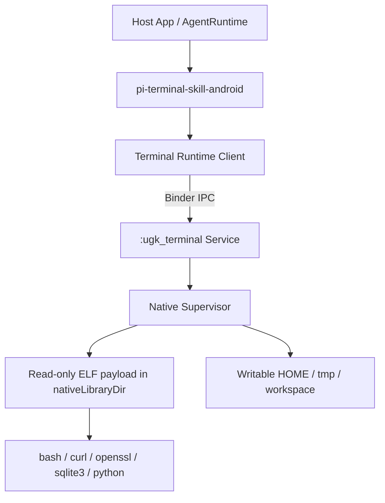

# 【历史归档】UGK Android Headless Terminal Runtime 开发与验证计划

> 本文件是历史过程记录，不是当前事实源。它保留原始计划和当时的 Gate 进展；当前计划以 `../../terminal-runtime-development-plan.md` 为准。

> 状态：Phase 0、Core Release Gate 1，以及 Gate 3 的 x86_64 API 24/36 控制回归已完成；v1 Core Profile（Bash、curl、OpenSSL、SQLite 与 CPython）已通过 x86_64 API 24/29/35 的 4 KB 与 API 36 的 16 KB 双 applicationId 回归；Gate 2 的 arm64 与其余 page-size/API 格仍待环境；Node.js 不属于 v1
> 制定日期：2026-08-12
> 适用仓库：`awesome-ugk-agent-android`

## 当前 scope decision（2026-08-13）

- v1 正式范围固定为 **Bash、curl、OpenSSL、SQLite、CPython 3.14.6**，最低支持
  `minSdk 24`；这些能力必须在同一 Core Profile 的代码、锁文件、文档和验证矩阵中保持一致。
- Node.js 不支持、不打包、不宣称，不再是 v1 的 Gate、里程碑或发布阻塞项；本次 POC
  容器已停止。
- 现有 Node POC 的源码、补丁、输出目录和日志只作为实验资料保留，不进入 v1 交付物。
- 如果未来恢复 Node，必须作为独立的可选 AAR/扩展模块，单独冻结体积、安全边界、兼容矩阵、
  许可证和设备回归；它仍随宿主 App 安装，不要求第二个 App。

## 实施状态（2026-08-12）

- **Phase 0：完成。** 工程已统一到 `minSdk 24`、`compileSdk/targetSdk 36`、AGP 8.11.1、
  Kotlin 2.2.21、JDK 17、NDK r28.2；原有 SDK 单元测试和 Demo 构建已回归。
- **Phase 1：x86_64 API 35 完成。** 同一 Runtime 模块在
  `com.ugk.runtime.demo.a` 与 `com.example.runtime.demo.b` 中都能从各自的
  `nativeLibraryDir` 执行原生 Probe、Bash、SQLite、curl、OpenSSL 和 CPython。arm64 载荷已构建并
  完成 ELF 静态检查，但尚无 arm64/16 KB 真机运行证据。
- **Phase 2：部分完成。** 当前 v1 Core Profile 包含 Bash、SQLite（禁止动态扩展加载）、curl
  （仅 `file/http/https`）、OpenSSL 静态 crypto CLI、锁定 CA bundle，以及 CPython 3.14.6
  （`python` / `python3`、`ssl/sqlite3/hashlib/subprocess` 已设备验证）。Git、OpenSSH、jq
  等不属于 v1，Node.js 也不再进入当前计划。
- **Phase 3：部分完成。** 已有带确认包装的 `terminal_bash_execute`、工作目录/环境变量/
  输出/超时约束、Tool 协程取消中断、单 Tool 并发上限，以及 `setsid + kill(-pgid)` 的同
  session 子进程树清理（x86_64 API 24/29/35 4 KB 与 API 36 16 KB 设备回归）。同一
  `TerminalAgentPlugin` 实例内已实现
  显式 `cancel(callId)` / `cancelAll()`；尚未实现跨进程或集中式 Supervisor 级 cancel-by-id、
  独立 Service、Binder 和逃逸进程治理。

详细实测与当前限制见
[`terminal-runtime-bash-slice-results.md`](terminal-runtime-bash-slice-results.md)、
[`terminal-runtime-network-slice-results.md`](terminal-runtime-network-slice-results.md) 和
[`terminal-runtime-python-slice-results.md`](terminal-runtime-python-slice-results.md)；进程组
清理的证据见 [`terminal-runtime-supervisor-slice-results.md`](terminal-runtime-supervisor-slice-results.md)。

## 1. 结论与已确认方向

本项目 v1 将实现一个随宿主 App 一起安装、无终端 UI、无需额外安装 Termux 的 Headless Terminal Runtime。Agent 可通过 `AgentTool` 使用 Bash、curl、OpenSSL、SQLite 和 CPython；扩展能力不属于 v1 Core Profile。

采用以下方向：

- 最终用户只安装一个 App。
- Runtime 作为 SDK 的可选模块随 APK/AAB 发布。
- `minSdk = 24`。
- Runtime 基于 Termux 的构建经验、补丁和软件包生态，但不直接嵌入现成 Termux App 或现成 rootfs。
- 所有 ELF 可执行文件和动态库必须随 APK/AAB 安装到只读代码位置，不能从宿主可写目录直接执行。
- Runtime 必须可重定位，不得依赖 `com.termux` 或任何固定宿主 `applicationId`。
- 第一版采用“可信 Agent Runtime”模型：独立进程用于稳定性和生命周期管理，但不宣称形成宿主 UID 之外的安全沙箱。
- Runtime 的原生组件只通过 SDK/App 版本更新，不支持 `apt/pkg upgrade` 或运行时安装原生二进制。

## 2. 项目目标

### 2.1 v1 Core Profile 必须实现

- 在同一个 App 内启动无 UI 的终端 Runtime。
- Agent 能同步执行有时间上限的命令，并获取结构化结果。
- 支持 `arm64-v8a` 真机；支持 `x86_64` 模拟器用于 CI 和开发验证。
- 支持以下固定命令集：
  - `bash`
  - `curl`、锁定 CA certificates（仅 `file/http/https`）
  - `openssl`
  - `sqlite3`
  - `python` / `python3`（CPython 3.14.6 及已验证的 `ssl/sqlite3/hashlib/subprocess`）
- 在至少两个不同 `applicationId` 的 App 中引用同一份已发布 Runtime artifact 并成功运行。
- 支持 Android API 24 到 API 36，并通过 16 KB page size 验证。
- 能可靠地超时、取消并终止完整子进程树。
- 生成锁定版本清单、校验值、SBOM 和第三方许可证清单。

### 2.2 v1 明确不做

- Termux UI、PTY 终端窗口和交互式终端模拟器。
- 额外安装 Termux 或 Companion App。
- `apt`、`pkg` 和 Runtime 自更新。
- `sshd`、数据库服务等长期驻留 daemon。
- 任意下载并执行 `.so`、DEX、JAR 或其他原生代码。
- 承诺兼容任意运行时安装的 native wheels、native addons 或其他原生扩展。
- 打包或宣称 Node.js；Node 未来若恢复，只能走独立可选 AAR/扩展模块。
- 在 Core Release Gate 之前开始 Git、OpenSSH 或 jq 的实现。
- `armeabi-v7a` 和 `x86` 生产支持。
- 把普通 `android:process` 描述为权限安全边界。
- 对所有 GNU/Linux 软件包提供兼容承诺。

## 3. 成功定义

只有同时满足以下条件，Runtime v1 才可发布：

1. 同一 Maven artifact 在 `com.ugk.runtime.demo.a` 和 `com.example.runtime.demo.b` 中运行，无需重新编译 Runtime。
2. 运行时路径中不存在对 `/data/data/com.termux`、`com.ugk.runtime.demo.a` 或其他固定包名的依赖。
3. 固定命令集的功能测试全部通过。
4. API 24、29、34、35、36 测试通过；16 KB arm64 环境测试通过。
5. Release APK 和从 AAB 生成的 split APK 均通过。
6. 超时和取消后没有遗留子进程。
7. 输出量、并发数、执行时间和磁盘写入均有硬限制。
8. 宿主开发者必须显式启用 Terminal Plugin；默认不注册终端工具。
9. 安全说明准确披露同 UID 风险，不把工作目录限制描述为沙箱。
10. 第三方组件版本、源码来源、补丁、许可证和哈希均可追溯。

## 4. 推荐总体架构



### 4.1 SDK 模块

#### `pi-terminal-skill-android`

职责：

- 实现 `AgentCapabilityPlugin`。
- 暴露终端 Tool 和对应 `AndroidSkill`。
- 将 Tool 调用转换为 Runtime IPC 请求。
- 不包含大型二进制。

当前 POC 已暴露：

```text
terminal_bash_execute
```

`terminal_bash_execute` 当前输入：

```json
{
  "script": "curl --fail --silent https://example.com",
  "workingDirectory": "projects/demo",
  "timeoutMillis": 30000
}
```

建议输出：

```json
{
  "exitCode": 0,
  "stdout": "...",
  "stderr": "...",
  "durationMillis": 314,
  "timedOut": false,
  "outputTruncated": false
}
```

完成 Binder/Supervisor 后，可在不破坏现有 Tool 的前提下增加 `terminal_runtime_info`；长期任务、PTY 和
`terminal_start_job/read/kill` 推迟到 v2，避免第一版同时解决后台保活和交互式终端问题。

#### `ugk-terminal-runtime-android`

职责：

- 声明和管理 `:ugk_terminal` Service。
- 提供 Binder/AIDL 或等价的稳定 IPC 接口。
- 初始化目录、环境变量和 Runtime manifest。
- 执行并监控 Native Supervisor。
- 管理超时、取消、输出截断和并发限制。

#### Runtime native payload

职责：

- 保存固定版本的 ELF 可执行文件和动态库。
- 以 Android 能识别的 `lib/<abi>/lib<name>.so` 形式进入 APK/AAB。
- 通过逻辑名称到物理文件名的 manifest 映射命令。
- 使用 `$ORIGIN`、启动器注入路径或必要补丁实现重定位。

建议 Runtime 构建流水线与 SDK 源码解耦：构建流水线从锁定的 Termux packages commit 和上游源码生成二进制，SDK 仓库只消费有哈希和清单的发布产物。不要把完整 Termux packages 仓库复制进当前代码库。

### 4.2 进程模型

默认结构：

```text
com.customer.app               宿主主进程
com.customer.app:ugk_terminal  Runtime Service 进程
└── bash/python/...            子进程
```

说明：

- 用户只安装一个 App。
- 独立进程可以隔离崩溃和部分内存压力。
- 独立进程和宿主仍是同一个 UID，能够访问宿主私有数据。
- `android:isolatedProcess="true"` 只作为后续实验方向；它没有宿主权限，直接网络访问和文件访问需要受控代理，不能直接替换当前模型。

### 4.3 文件系统布局

```text
nativeLibraryDir/                 只读、可执行
├── libugk_exec_bash.so
├── libugk_exec_python.so
├── libugk_exec_curl.so
└── libugk_dep_*.so

files/ugk-runtime/                可写、不可作为原生代码来源
├── home/
├── tmp/
├── workspace/
├── python-stdlib/
├── certs/
└── runtime-manifest.json
```

关键规则：

- ELF 只能来自随 App 安装的只读代码位置。
- 可写目录中的脚本必须由已安装解释器读取执行，不能假定脚本本身可以直接 `execve()`。
- 不把宿主密钥、Token、SharedPreferences 内容注入环境变量。
- 默认工作目录为专用 workspace，但必须明确它不是安全沙箱。

## 5. 工具链基线

当前仓库已达到以下 Runtime 开发基线：

- `minSdk = 24`
- `compileSdk = 36`
- Demo `targetSdk = 36`
- AGP 8.11.1
- Gradle 8.13（项目 Wrapper；当前本机构建也以兼容的 Gradle 8.14.3 验证）
- JDK 17
- NDK r28 或更新的稳定版本
- 64 位 ELF 全部启用并验证 16 KB alignment

后续升级仍必须单独提交、单独验证，不与 Runtime 功能变更混在一起。

## 6. Runtime 版本和依赖策略

### 6.1 版本锁定

不能只锁定 Bash、Python 等顶层版本，必须锁定 Core Profile 的整个依赖闭包：

- Termux packages commit
- 每个上游源码版本和下载 URL
- 每个源码包 SHA-256
- 每个应用补丁的 commit/hash
- NDK、Clang、构建镜像版本
- 每个 ABI 的产物 SHA-256

每次 Runtime 发布生成：

```text
runtime-lock.json
runtime-manifest.json
checksums.txt
sbom.spdx.json
THIRD_PARTY_NOTICES.md
```

### 6.2 更新策略

- Runtime 与 Kotlin SDK 分开版本化。
- 原生包更新只通过新的 SDK/App 版本发布。
- 安全更新按完整依赖闭包重新构建和回归，不做单包滚动升级。
- 保留至少一个上一版本 Runtime 的复现能力。

### 6.3 Python 与未来扩展策略

- CPython 解释器可以内置；v1 只交付锁定的 CPython Core Profile。
- v1 不承诺 Runtime 动态安装原生扩展。
- 需要的 native wheels/addons 必须在发布前纳入固定 Runtime 并完整回归。
- 未来任何可选解释器或工具都必须独立锁定源码、体积、许可证、安全边界和兼容矩阵；不自动
  成为 v1 能力。

## 7. 安全模型

### 7.1 明确威胁

一旦 Agent 拥有 Bash 或 Python，以下能力无法通过命令字符串白名单可靠阻止：

- 读取同 UID 下的宿主私有文件。
- 修改或删除宿主数据。
- 访问网络并传输可读取的数据。
- 创建子进程和消耗 CPU、内存、文件描述符及磁盘。
- 通过脚本组合绕过表面上的命令分类。

### 7.2 第一版授权模型

SDK 默认不注册 Terminal Plugin。宿主必须显式选择一种模式：

```text
DENY             完全禁用，默认值
CONFIRM_EACH     每次执行前确认
TRUSTED_SESSION  用户显式授权一段会话，授权可撤销并有过期时间
```

需要在 API 文档中明确：

- `TRUSTED_SESSION` 相当于授予 Agent 宿主 App 沙箱内的命令执行权。
- `cwd` 限制、PATH 限制和提示词都不是安全边界。
- 如果宿主不能接受该风险，应使用专门 HTTP/File Tools，不能启用完整终端。

### 7.3 Supervisor 强制限制

初始建议默认值：

- 单次默认超时：30 秒。
- 单次硬上限：5 分钟，由宿主显式配置后才能提高。
- 最大并发命令：1。
- `stdout`、`stderr` 分别最多保留 1 MiB，超限后继续排空但停止累计。
- 每次执行创建独立进程组；取消时终止整个进程组。
- 设置合理的 `RLIMIT_NOFILE`、`RLIMIT_FSIZE`、`RLIMIT_NPROC` 等资源上限；具体值在真机测试后冻结。
- Service 不导出，所有 IPC 调用校验调用方 UID。
- 禁止调用方任意注入 `LD_PRELOAD`、`LD_LIBRARY_PATH` 和宿主敏感环境变量。

## 8. 分阶段开发计划

### Phase 0：工程基线和发布边界

任务：

- 将所有模块 `minSdk` 统一为 24。
- 将工具链升级到 API 36 和 16 KB 兼容基线。
- 补充仓库根许可证。
- 建立第三方许可证和 SBOM 输出约定。
- 增加 Runtime ADR，记录单 App、可信进程、无包管理器等决策。
- 保证现有 SDK 单元测试和 Demo 构建继续通过。

退出条件：

- 现有功能全部通过。
- Debug/Release AAR 和 Demo APK 可构建。
- 工具链升级是独立、可回滚的变更。

### Phase 1：最小 ELF 执行探针

先不编译 Termux，也不接 Agent。

任务：

- 使用 NDK r28+ 构建一个无外部依赖的 `ugk-runtime-probe` ELF。
- 以原生载荷随 AAR/APK 打包。
- 从 `nativeLibraryDir` 启动并采集退出码、stdout、stderr。
- 验证绝对路径执行、逻辑命令映射和只读属性。
- 验证符号链接入口；如果失败，改为 manifest 映射直接执行物理路径。
- 构建 Demo A 和 Demo B，使用相同 artifact 验证不同 `applicationId`。

退出条件：

- API 24、29、34、36 都能执行。
- arm64 16 KB 环境通过。
- Release AAB split 安装后通过。
- artifact 内不存在宿主包名硬编码。

停止条件：

- 如果无法找到符合现代 Android 约束的稳定执行方式，停止后续 Termux 集成，重新评估 JNI 内嵌解释器或远程 Runtime。

#### Phase 1 实测记录（API 35 x86_64，2026-08-12）

- 使用 `useLegacyPackaging = true` 时，Package Manager 会提供实际的 `nativeLibraryDir` ELF 文件；两个不同 `applicationId` 都已成功执行 Probe。
- 使用未压缩 APK 原生库（`extractNativeLibs = false`）时，`nativeLibraryDir` 不存在对应文件，Probe 在 `ProcessBuilder` 前即失败。这种现代直接映射形式不能直接作为外部 `execve()` 入口。
- 因此当前 POC 的可执行交付机制为“安装时提取的原生载荷”。这不等同于 16 KB 设备已验证；arm64 16 KB 真机验证继续是发布 Gate，未通过前不能锁定最终发布方式。

### Phase 2：可重定位基础 Runtime

任务：

- 锁定 Termux packages 基线 commit。
- 已构建 Bash、SQLite、CA certificates、OpenSSL、curl 和 CPython 3.14.6；CPython 的
  解释器、依赖库和扩展模块保持在 `nativeLibraryDir`，标准库以已锁定归档重建到私有目录。
  下一步先完成 Core Release Gate；Git、OpenSSH、jq 仅在 v1 之后按独立批次评估。
- 清点 ELF、脚本、配置中的 `$PREFIX` 和 `com.termux` 路径。
- 使用 `$ORIGIN`、运行时 manifest 和补丁消除固定宿主路径。
- 验证 shell 脚本、shebang、动态链接器、DNS、TLS 和证书路径。
- 建立可重复构建容器和产物哈希。

退出条件：

- Demo A/B 使用同一 artifact 运行 `bash`、HTTPS Curl 和 CPython 基础模块。
- 对二进制和文本扫描不再发现禁止的固定路径。
- 连续全新构建得到相同版本清单和可解释的产物差异。

### Phase 3：Supervisor 与 Agent Tool

任务：

- 新增 `ugk-terminal-runtime-android`。
- 实现私有 Binder Service 和 Native Supervisor。
- 实现超时、取消、进程组终止、输出截断和并发控制。
- 新增 `pi-terminal-skill-android`。
- 实现 `terminal_exec`、`terminal_runtime_info`。
- 集成现有 `UserConfirmationRequiredTool`，并补充 Terminal 专用授权状态。
- 为 Tool schema、错误映射和生命周期编写单元测试。

退出条件：

- Agent 能通过 Tool 执行命令并获得结构化结果。
- 超时、取消和宿主进程重建测试通过。
- 无遗留子进程和无限输出导致的内存增长。

### Phase 4：Core Release Gate 与可选扩展评估

先冻结并验证 v1 Core Profile，不在该 Gate 中增加新的大型 Runtime：

1. Bash、SQLite、curl、OpenSSL + CA（已完成 x86_64 双 applicationId 设备验证；arm64
   仅完成静态 ELF 验证）。
2. Python 及其 `ssl`、`sqlite3`、`hashlib`、`subprocess`（已完成 x86_64 API 24/29/35
   4 KB 与 API 36 16 KB 双 applicationId 设备验证；API 35 另有 Release split 证据，arm64
   仍只有静态 ELF 验证）。
3. 依次完成两 ABI ELF/打包/16 KB 静态检查、API/设备矩阵、双 applicationId 重定位、
   生命周期/取消/超时/并发/低磁盘/升级迁移和安全边界验证。
4. Core Release Gate 通过后，才分别评估 jq、OpenSSH、Git；每个扩展独立锁版本、体积、
   许可证、安全边界和设备矩阵。
5. Node.js 不在此阶段评估；未来若恢复，单独建立可选 AAR/扩展模块计划。

#### Core Release Gate 1：双 ABI 原生静态验收（2026-08-13）

- `scripts/terminal-runtime/verify-runtime.ps1 -CheckPackages` 已固化并通过两 ABI 的
  Runtime source payload、Release AAR 与两个 probe APK 检查：runtime-lock、实际文件和
  AAR/APK 内容一致；ELF class/machine/type、DT_NEEDED 闭包、GNU_STACK、TEXTREL、
  PT_LOAD 16 KB 对齐和 v1 Core 无 Node 映射均通过。
- 首次检查发现上游预编译 CPython package 的两份 `libsqlite3_python.so` 带有
  `RUNPATH [/usr/local/lib]`。已由 `normalize-python-sqlite-rpath.ps1` 用锁定版本的
  `patchelf --remove-rpath` 净化；脚本在修改前后断言精确 RUNPATH、DT_NEEDED、ABI 和
  PT_LOAD 对齐，runtime-lock 只更新对应两份哈希。
- AAR/APK 的原生库当前均为压缩 ZIP entry，因此 `zipalign -c -P 16` 通过只表示 ZIP
  校验通过；它不替代 ELF 16 KB 静态检查，也不替代 arm64/16 KB 真机验证。
- Gate 1 的静态 PASS 本身不构成 API 24/29/35/36 设备矩阵、arm64/16 KB 环境、双
  `applicationId` 重定位、生命周期/取消/超时/并发/低磁盘/升级迁移或安全边界的运行证据。

#### Core Release Gate 2：设备矩阵（2026-08-13）

- 本机原有 API 35 x86_64 / 4 KB 通过后，只向 `E:\Android\SDK` 补齐
  `system-images;android-24;default;x86_64` revision 8、
  `system-images;android-29;default;x86_64` revision 8 和
  `system-images;android-36;google_apis_ps16k;x86_64` revision 7。没有下载额外 API 35、
  arm64、Play Store 或 API 36 4 KB image；AVD data 全部位于 `E:\Android\.android\avd`。
- API 24/29/35 x86_64 / 4 KB 与 API 36 x86_64 / 16 KB 均以同一 A+B
  `connectedDebugAndroidTest` 组合命令通过：Demo A 7/7、Demo B 5/5，零
  fail/error/skipped，HTTPS 均为 HTTP 200。三套新补齐 image 首轮通过；API 35 是清理
  in-scope 旧签名 probe 包后的稳定复跑。
- 已覆盖 Bash、SQLite、curl/HTTPS、OpenSSL、CPython
  `ssl/sqlite3/hashlib/subprocess`、stdlib 自修复、超时进程树和两个
  `applicationId` 各自的 nativeLibraryDir/Python prefix 重定位。API 36 设备实际返回
  16384-byte page size；这仍不是 arm64 16 KB 证据。
- 三个新建临时 AVD 均隐藏窗口、固定端口、无 snapshot、无 `wipe-data`；每轮测试后 target/
  test package、instrumentation 与 Runtime/descendant 进程均无残留。临时 AVD 已精确删除，
  system image 保留；原有 `codex_api35` 与 `pushup_trial_api35` 数据未修改。
- 安装 API 36 image 时 SDK 工具把 Emulator 35.1.20 更新到 37.1.11，并在 E 盘保留
  `emulator.backup`；详细 package 体积、fingerprint、清理证据和最终矩阵见
  `docs/terminal-runtime-probe-results.md`。
- Gate 2 仍为部分完成：arm64 4 KB/16 KB、API 35 x86_64 / 16 KB、API 36 x86_64 /
  4 KB 与 API 34 格尚无设备证据。下一项应获取实际 arm64 4 KB 与 arm64 16 KB 环境，
  不以 x86_64 AVD 的兼容 ABI 列表替代。

#### Core Release Gate 3：Runtime 控制与生命周期（2026-08-13）

- API 24 x86_64 / 4 KB 与 API 36 x86_64 / 16 KB 均通过 Demo A 10/10、Demo B 5/5，
  零 fail/error/skipped。用例覆盖默认用户确认、主动取消、普通超时、TERM-resistant
  descendant 的 SIGKILL 升级、Bash/SQLite/curl/HTTPS/OpenSSL/CPython/execmem 与双
  `applicationId` 重定位。
- `BashCommandToolTest` 为 10/10，覆盖重复 call id、运行中/排队取消、`cancelAll()`、
  并发槽位复用、stdout/stderr 独立截断和环境变量约束。`cancel(callId)` 与 `cancelAll()`
  当前是同一 `TerminalAgentPlugin` 实例范围内的 API。
- Runtime 清空 `ProcessBuilder` 初始环境，只注入受管理的 `HOME/PWD/TMPDIR/PATH`、
  `LD_LIBRARY_PATH`、`ANDROID_DATA/ANDROID_ROOT`、Python/CA/Bash 配置和会话报告路径；
  Tool 不能覆写这些变量。超时或取消通过 `setsid + kill(-pgid)` 清理同一 POSIX session，
  必要时从 SIGTERM 升级到 SIGKILL。
- 为保持 `minSdk 24`，存活判断使用 `Process.exitValue()` 的旧 API 契约，不调用 API 26+
  的 `Process.isAlive()`；API 24 与 API 36 设备回归均已验证 Python/execmem 正常。
- Gate 3 尚不包含跨进程/独立 Service/Binder Supervisor、Android 进程被杀后的恢复、主动
  逃逸进程治理、低磁盘与升级迁移；它也不是 UID/权限安全沙箱。上述项目仍属于发布前工作。

每批任务：

- 记录完整依赖闭包和许可证。
- 检查绝对路径和动态链接依赖。
- 测量新增下载体积、安装体积、启动时间和内存。
- 回归两个 `applicationId`、API 版本和 16 KB 环境。

退出条件：

- 固定命令集全部通过验证矩阵。
- 没有未解释的动态库、许可证或源码来源。
- 产品负责人接受最终体积和性能数据。

### Phase 5：安全、稳定性和发布

任务：

- 完成威胁模型和提示注入场景测试。
- 扫描依赖 CVE，建立更新响应流程。
- 完成低内存、低磁盘、进程被杀、App 升级和 Runtime 迁移测试。
- 验证 Google Play Device and Network Abuse、SDK Requirements 和前台服务政策。
- 发布 Maven 本地候选版本，由独立样例 App 消费。
- 再发布内部 Maven/预发布仓库候选版本。
- 补齐接入文档、权限披露、安全说明和故障排查。

退出条件：

- 所有 P0/P1 缺陷关闭。
- 发布检查清单全部签字确认。
- Maven 消费测试不依赖当前仓库源码或未发布文件。

## 9. 验证矩阵

### 9.1 平台矩阵

| 维度 | 必测值 |
|---|---|
| 宿主包名 | `com.ugk.runtime.demo.a`、`com.example.runtime.demo.b` |
| Android | API 24、29、34、35、36 |
| Page size | 4 KB、16 KB |
| ABI | `arm64-v8a` 真机/模拟器、`x86_64` 模拟器 |
| 构建 | Debug APK、Release APK、Release AAB split |
| 安装状态 | 首次安装、覆盖升级、卸载重装、Runtime 数据迁移 |
| 设备状态 | 在线、离线、低磁盘、低内存、后台切换、进程被杀 |

说明：`minSdk 24` 不等于支持所有 API 24 设备。v1 不包含 `armeabi-v7a`，因此 32 位-only 设备不在支持范围内。

### 9.2 功能用例

| ID | 验证内容 | 通过条件 |
|---|---|---|
| RUN-001 | Probe ELF | 输出、退出码正确 |
| RUN-002 | Bash 管道和重定向 | 管道、引号、环境变量、文件输出正确 |
| RUN-003 | Curl HTTPS | DNS、TLS、证书验证正常 |
| RUN-004 | OpenSSL | 摘要、随机数、证书解析正常 |
| RUN-005 | SQLite | 建库、事务、查询正常 |
| RUN-006 | Python | `ssl/sqlite3/hashlib/subprocess` 正常 |
| RUN-007 | Unicode | 中文路径、参数和输出正确 |
| RUN-008 | 大输出 | 不 OOM，结果被标记为截断 |
| RUN-009 | 超时 | 到期终止整个进程树 |
| RUN-010 | 取消 | Agent 取消后无遗留进程 |
| RUN-011 | 并发 | 超限请求被排队或明确拒绝 |

### 9.3 重定位用例

- 对所有产物执行字符串扫描，禁止出现固定宿主包名。
- 比较 Demo A/B 的 Runtime manifest，除系统分配路径外内容一致。
- 分别验证 Python stdlib 和 CA bundle 的定位；未来扩展必须自行建立数据目录定位测试。
- 在 secondary user/work profile 中增加一轮验证，避免依赖 `/data/data/<package>` 的主用户假设。

### 9.4 安全用例

- 未注册插件时，Agent 看不到 Terminal Tool。
- `DENY` 模式下所有调用失败且不启动进程。
- `CONFIRM_EACH` 未确认时不执行。
- `TRUSTED_SESSION` 到期或撤销后立即拒绝新命令。
- 非导出 Service 不能被其他 App 启动或绑定。
- IPC 调用方身份验证失败时拒绝执行。
- 环境变量和错误日志不包含宿主 API Key。
- 路径穿越测试必须记录实际同 UID 能力，不能产生虚假的“沙箱已阻止”结论。
- Prompt injection 测试覆盖读取宿主密钥、上传数据、删除文件和持久化进程等诱导。

### 9.5 生命周期和资源用例

- 宿主切后台后，短命令正常结束或得到明确中止结果。
- Runtime Service 被系统杀死后，调用方得到确定错误，不永久挂起。
- App 升级后旧 Runtime 数据可迁移或安全重建。
- 低磁盘时初始化失败不会留下“半安装”状态。
- 子进程 fork 后取消仍能清理完整进程组。
- 超长 stdout/stderr 不阻塞子进程管道。

## 10. 性能与体积验收

Phase 2 首次测量后冻结正式预算。在预算冻结前使用以下临时目标：

- Bash 空命令冷启动 p95 不高于 500 ms。
- Python 空程序冷启动 p95 不高于 1.5 s。
- `terminal_exec` 额外 IPC/监督开销 p95 不高于 100 ms。
- Runtime 空闲时不保留无必要子进程。
- arm64 单 ABI 的 v1 Core 增量压缩体积临时上限为 100 MiB。
- v1 Core 安装后磁盘增量临时上限为 300 MiB。

这些数字不是当前承诺；Phase 2/4 必须提供真机数据，由产品负责人决定接受、裁剪软件包或调整预算。

## 11. CI 与发布验证

### 每次提交

- Kotlin/JVM 单元测试。
- Android lint 和所有现有模块测试。
- Debug Demo 构建。
- Runtime manifest/schema 校验。
- 固定路径和禁用符号扫描。

### Runtime 产物变更

- 对每个 ABI 完整重建。
- ELF 架构、动态依赖、PIE、RUNPATH 和 16 KB alignment 检查。
- SBOM、许可证和 checksum 生成。
- API 24、29、36 冒烟测试。
- Demo A/B 重定位测试。

### 发布候选

- 完整平台与功能矩阵。
- Release AAB + `bundletool` split 安装测试。
- 安全、生命周期、低资源和升级测试。
- 独立消费项目从 Maven 仓库接入测试。
- CVE 和 Google Play 政策复核。

## 12. 风险登记表

| 风险 | 等级 | 应对 | 关闭条件 |
|---|---|---|---|
| 可写目录 ELF 无法执行 | 高 | APK 原生载荷 | Phase 1 全平台通过 |
| Termux `$PREFIX`/包名硬编码 | 高 | 可重定位补丁和双包名测试 | Phase 2 通过 |
| 脚本/shebang 在 no-exec 目录失败 | 高 | 解释器显式执行或只读载荷映射 | 脚本矩阵通过 |
| 同 UID 读取宿主秘密 | 高 | 显式可信模式、文档和授权 | 产品接受风险；不得错误宣传隔离 |
| Agent 提示注入导致命令滥用 | 高 | 默认关闭、确认模式、会话授权 | 安全场景通过并完成披露 |
| Play 动态代码政策风险 | 高 | 固定随包发布、无 Runtime 原生更新 | 政策复核通过 |
| 16 KB 不兼容 | 高 | NDK r28+、ELF/zip alignment 检查 | 16 KB 环境通过 |
| v1 Core 体积过大 | 中高 | AAB ABI split、后续能力独立可选模块 | 产品接受实测数据 |
| 长任务被 Android 杀死 | 中高 | v1 只承诺限时命令 | 生命周期矩阵通过 |
| GPL/第三方许可证遗漏 | 高 | SBOM、NOTICE、源码对应关系 | 法务/发布检查通过 |
| 上游安全更新维护成本 | 中高 | 锁定构建、定期 CVE 扫描 | 更新流程演练通过 |
| Native library 名称冲突 | 中 | `libugk_*` 前缀和依赖扫描 | 消费项目测试通过 |

## 13. 行动顺序

严格按以下顺序推进，前一 Gate 未通过不进入下一项：

1. **基线升级**：minSdk 24、API 36、AGP/Gradle/NDK、现有测试。
2. **执行探针**：一个自建 ELF，从 APK 原生位置执行。
3. **双 App 验证**：同一 artifact、两个 `applicationId`、AAB split。
4. **基础 Runtime**：Bash + Curl + OpenSSL，解决重定位和脚本执行。
5. **Supervisor**：IPC、超时、进程树清理、输出限制。
6. **Agent 接入**：`terminal_exec` 和授权模式。
7. **Core Release Gate**：两 ABI ELF/打包/16 KB、设备矩阵、双 applicationId、生命周期、安全和体积。
8. **后续可选评估**：Core Gate 通过后依次评估 jq → OpenSSH → Git，每项独立交付。
9. **未来 Node 选项**：仅在另行立项为可选 AAR/扩展模块后评估，不回写为 v1 Gate。
10. **发布准备**：许可证、SBOM、文档、Maven 消费和 Play 政策复核。

第一项实际开发任务应是 Phase 0；第一项 Runtime 技术任务必须是 Phase 1 的最小 ELF 探针。Core Release Gate 未通过前，不开始 Git/OpenSSH/jq，也不恢复 Node 实验。

## 14. 开始实施前后的决策点

以下事项不阻塞 Phase 0 和 Phase 1，但必须在对应阶段前确认：

- Phase 2 前：Runtime 构建流水线使用独立仓库还是当前仓库的独立目录。
- Phase 3 前：`CONFIRM_EACH` 与 `TRUSTED_SESSION` 的宿主 UI/API 形态。
- Phase 4 前：是否把 `pip`、`npm` 命令本身放入发行版，以及发行渠道是否包含 Google Play。
- Core Release Gate 结束时：是否接受实测体积，还是将后续 jq/OpenSSH/Git 拆为可选 Runtime flavor。
- v1 发布前：是否只支持 `arm64-v8a` 生产设备；`x86_64` 默认仅用于模拟器和测试。

## 15. 权威约束资料

- [Android 10：禁止从可写应用目录执行代码](https://developer.android.com/about/versions/10/behavior-changes-10)
- [Google Play target API 要求](https://developer.android.com/google/play/requirements/target-sdk)
- [Android API level 对应最低 AGP 版本](https://developer.android.com/build/releases/about-agp)
- [Android 16 KB page size 支持要求](https://developer.android.com/guide/practices/page-sizes)
- [Android ABI 和 APK 原生库布局](https://developer.android.com/ndk/guides/abis)
- [Google Play Device and Network Abuse](https://support.google.com/googleplay/android-developer/answer/16559646)
- [Termux execution environment](https://github.com/termux/termux-packages/wiki/Termux-execution-environment)
- [Termux package building](https://github.com/termux/termux-packages/wiki/Building-packages)
- [Termux Android 10 设计说明](https://github.com/termux/termux-packages/wiki/Termux-and-Android-10/87a1cd57acef83399c1539225b284ec8bd533780)
