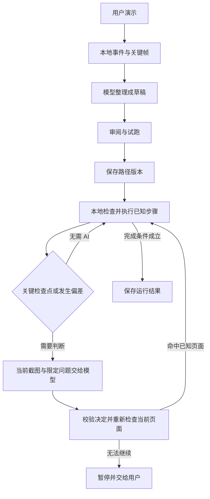

# 演示学习与操作复用：当前实现与后续设计

更新：2026-09-28。状态：**Slice A 本地演示录制与草稿已实现并通过本机定向验证；Slice B 整理/试跑、Slice C 自动复用待实现**。当前 Demo 为 `1.11.0 / 124`；紧凑浮条获用户“可以测试通过”反馈，详情布局后用户回复“OK”并要求版本保存。认可范围为这两项 UI 调整，设备未注明；本阶段本地保存边界见[版本台账](demo-app-version-ledger.md)，尚未发布。

源码基线：`d7a7bad8162e5d29302cdfafe40011498b5c7fee`。最初摸排只形成设计文档；2026-09-28 后续工作树先优化现有观察策略与计时路由发图，再实现下述 Slice A。录制产物是原始演示素材，不是已学习步骤；本地路径执行器仍未实现。

用户目标是把一次演示转成可以重复使用的操作经验：已知步骤本地执行，需要理解动态内容或遇到偏差时才调用用户配置的视觉模型，恢复后继续已有路径。首版交付应是 App 内完整的“演示 → 整理 → 审阅 → 试跑 → 再次执行”闭环。

前置实验已在 Android 15 / API 35 模拟器用普通 AccessibilityService 跑通七步设置流程、182px 控件位移、缺失目标停止，以及真实 GLM 判断后返回一次、从原第三步继续。正常混合运行使用一次有效视觉请求。路径提炼当时由 Codex 中的 Astra 完成，尚未验证 Android 内自动提炼。详细材料是[本机实验报告](../.verify-shots/operation-demo-feasibility-20260928-111151/FEASIBILITY-REPORT.md)，未纳入版本库；本提案不把实验成功记作 SDK 已实现。

## 当前已实现：Slice A

入口为主聊天附件菜单“添加与工具 → 教我操作”。[原生页面](../demo-app/src/main/java/com/ugk/pi/android/testapp/DemoOperationLearningActivity.kt) 提供开始便签、实际准备检查、草稿列表、事件时间线、按需展开的关键画面及明确确认后的素材删除。名称为最多 120 字符的单行文字，键盘“完成”只收起键盘；开始需用户点击。缺少模型配置不阻止本地录制。尚无 AI 整理、步骤编辑、试跑、自动执行或定时复用入口。

草稿详情采用暖纸摘要卡承载状态、标题、日期与两列真实统计；空记录展示简洁空状态和“重新录制”，有记录展示分层时间线。重新录制只打开新的开始卡，保留当前草稿。记录说明默认折叠到主体之后，完整说明及关键画面仍按需查看；删除入口在更多菜单内，继续要求确认。浅色正常字号、深色 320dp/1.5 倍字号的两种草稿均经 AVD 检查，见[详情布局验证](../.verify-shots/operation-draft-layout-20260928/REPORT.md)。

[录制器](../demo-app/src/main/java/com/ugk/pi/android/testapp/DemoOperationRecorder.kt) 要求 Android 11 / API 30+、已连接的无障碍服务、悬浮窗权限和解锁状态。开始后进入桌面供用户选择目标 App；宿主、系统解析到的桌面及输入法事件不采集。采集点击、长按、滚动及窗口切换事件，关联有界页面结构与稳定关键帧；无法可靠关联的前后画面保留缺口说明，不把动作发生当成成功验证。图片使用普通 AccessibilityService 截图，没有新增 MediaProjection 或广泛存储权限。

状态为 `IDLE / RECORDING / PAUSED / SAVING`。暂停保持屏幕占用、使在途回调失效，不接收新的事件或画面；显示时长为实际录制累计时长，暂停时冻结。含输入控件、密码或输入法的页面采用保守暂停；继续必须由用户点击。在宿主或桌面点击继续会等待切回目标 App，不采集宿主/桌面；外部输入页面仍不能直接继续。后置帧仅能关联同一连续采集段、同一 App 的待处理事件，暂停或换包后不补到旧事件。取消保留中断草稿；服务断开、锁定或熄屏也停止并保存。保存结束前维持占用，浮条结束后自动打开对应草稿。

控制器由 `DemoProcessScope` 持有，Activity 旋转和切到目标 App 只附着/解绑 UI。人工录制与普通 Agent（包括尚在思考阶段）共用 `DemoCapabilityInterlock` 的 owner；非 Idle 的计时、排队消息、待处理 SDK_EVENT、重要提醒或确认窗口阻止开始录制。录制期间主界面和悬浮发送、会话切换/新建、设置及新的 Agent/SDK_EVENT 运行受到门禁；主会话停止入口可停止并保存录制。既有计时到点仍运行普通 Agent，没有接入录制草稿执行。

[本地存储](../demo-app/src/main/java/com/ugk/pi/android/testapp/DemoOperationDraftStore.kt) 位于 `<filesDir>/operation-learning/<draftId>/`，包括 `draft.json`、活动标记和关键帧文件。开始先持久化初始草稿与活动标记，再接收事件；后续串行原子检查点写入。进程可能没有退出回调，下次读取会扫描可读草稿，把未结束记录标为中断（即使活动标记缺失），清除已结束草稿的陈旧标记，不自动继续录制。损坏记录保留而不覆盖；未恢复或活动草稿不可删除。当前上限为 20 份草稿、单次 500 事件/40 帧/12MB 图片/8MB 结构文件，单次总会话 10 分钟（含暂停）；不自动淘汰旧草稿。记录中包含屏幕上可见文字，输入保护不能视为完整隐私识别，用户应查看素材并按需删除。

暂停/取消前已验证的画面，若文件写入已开始，可能完成在途写入；失效后不会纳入草稿，并删除该次未引用文件。若此时进程死亡，下次恢复仅移除可读、已收束草稿目录中符合采集器 UUID 命名且未被引用的 JPEG/临时图片，保留被引用素材、未知文件和损坏目录。不能将这一机制表述为“暂停后绝无任何磁盘写入”。

已观察到的系统边界：Android Settings 部分子页强制隐藏普通悬浮窗；不绕过系统限制，用户可回桌面或本 App 暂停/结束。录制页及主界面可见时隐藏重复浮条，回桌面恢复显示，已在 AVD 实测。当前录制浮条按用户反馈改为约 208×52dp 单行：呼吸录制点、计时、暂停/继续及结束图标；暂停时指示点静止，时间冻结，两个图标各有 48dp 触控区。浅深色和 1.5 倍字体定向测试及模拟器操作通过，见[紧凑浮条报告](../.verify-shots/operation-recording-compact-20260928/REPORT.md)；下段 280dp 和 250 项 JVM 测试是调整前的 Slice A 阶段证据。

阶段证据见[本机验证报告](../.verify-shots/operation-learning-integration-20260928/REPORT.md)：API 35 AVD 的 `SettingsDemo` 草稿 `3795dc1b-0484-47a1-a7b1-b2c12b875e66` 实录 **7 个事件、3 张关键帧、85 个节点**；暂停后操作 Settings，草稿字节保持不变；结束后打开真实草稿。搜索输入页自动暂停，测试输入没有进入草稿；进程强制结束后保留 3 事件/1 帧并标为中断；服务关闭与熄屏均停止录制。原生控件浅色/深色、280dp 与 1.5 倍字体检查通过，1080×1600 短屏下暂停/结束保持可达。最终构建及 Demo 206 + System skill 44 = **250 项 JVM 测试**通过，另有录制控件仪器测试 1 项通过。该结果不是“七个已学习步骤”，不证明自动整理/执行已完成。录制中使用 UIAutomator dump 会干扰该 AVD 的无障碍服务，采集中使用 screencap 和自有草稿数据观察。本轮 Slice A 未调用外部模型 API。

## 1. 现有能力与接入结论

| 位置 | 当前事实 | 集成结论 |
|---|---|---|
| [AgentAccessibilityService](../demo-app/src/main/java/com/ugk/pi/android/testapp/AgentAccessibilityService.kt)，`onAccessibilityEvent` | 更新外部包名并把事件交给进程录制器；非录制态不采集 | Slice A 已接入；后续提炼不能把原始事件直接视作步骤 |
| [ScreenAutomationBackend](../pi-system-skill-android/src/main/java/com/ugk/pi/android/ScreenAutomationBackend.kt)、[默认后端](../pi-system-skill-android/src/main/java/com/ugk/pi/android/AccessibilityScreenAutomationBackend.kt) | 已有界面树、语义节点操作、滚动、返回和截图；动作前严格校验最新 snapshot 与目标 | 复用观察和动作原语；新增语义定位及步骤执行层，不降低原校验 |
| [AgentRuntime](../ugk-pi-android/src/main/java/com/ugk/pi/android/AgentRuntime.kt)，`run` / `executeTool` | 普通循环每轮调用模型；工具内部可以报告进度；`executeTool` 是私有实现 | 不把每个保存步骤重新喂给 Runtime；新增一个可一次运行整条路径的宿主执行器 |
| [DemoProcessScope](../demo-app/src/main/java/com/ugk/pi/android/testapp/DemoProcessScope.kt)、[DemoCapabilityInterlock](../demo-app/src/main/java/com/ugk/pi/android/testapp/DemoCapabilityInterlock.kt) | 录制与 Agent run 已共用屏幕 owner，覆盖思考阶段占用 | 后续路径执行也须纳入同一占用机制 |
| [AgentFloatingWindow](../demo-app/src/main/java/com/ugk/pi/android/testapp/AgentFloatingWindow.kt)、[DemoOverlayController](../demo-app/src/main/java/com/ugk/pi/android/testapp/DemoOverlayController.kt) | 普通悬浮窗已有状态/停止/确认；新增独立紧凑录制条，共用进程停止入口 | 路径执行状态仍待实现；系统隐藏 overlay 的页面保留 App 内控制入口 |
| [ApiSettings](../demo-app/src/main/java/com/ugk/pi/android/testapp/ApiSettings.kt)、[ProviderProfile](../demo-app/src/main/java/com/ugk/pi/android/testapp/ProviderProfile.kt) | 多个 API 配置、一个 activeId；已有 OpenAI / Anthropic 协议归一化，没有独立视觉模型角色 | 首版沿用当前模型配置，复用 ProviderProfile；不硬编码 GLM，不再另写接口拼接逻辑 |
| [AgentMessage](../ugk-pi-android/src/main/java/com/ugk/pi/android/AgentMessage.kt)、两种 Provider | 已支持图片消息；具体配置的模型是否能识图仍需运行验证 | 用现有图片通道；不支持图片时保留草稿、提示更换配置，不能静默换模型 |
| [Skill 运行时规范](android-agent-skills.md) | SKILL.md 是模型上下文，`skill_save` 不提供脚本/配套资产执行 | 可提供路径索引或调用说明，但结构化路径和执行记录需要独立仓库 |
| [DemoConversationStore](../demo-app/src/main/java/com/ugk/pi/android/testapp/DemoConversationStore.kt)、[DemoAgentTraceStore](../demo-app/src/main/java/com/ugk/pi/android/testapp/DemoAgentTraceStore.kt) | 对话最多保留 100 条；诊断 trace 刻意不保存原始 prompt、response、command、text | 对话只追加摘要和路径引用；不把 trace 改造成录屏素材仓库 |
| [当前计时任务](demo-delayed-conversation.md)、[DemoDelayedMessageDispatcher](../demo-app/src/main/java/com/ugk/pi/android/testapp/DemoDelayedMessageDispatcher.kt) | 同一对话固定间隔/单次延时，到点启动完整 Agent 回合；当前 App 未注册旧 `agent_task_*` | 首版先手动复用；定时接入使用明确路径引用，单独扩展当前计时模型 |

## 2. 完整闭环目标（Slice B/C 待实现）

“教我操作”及本地草稿入口已实现；以下“已学操作”、模型整理、试跑和复用是后续闭环目标，不是当前菜单。管理页沿用现有 UI 风格，不把路径库放进 API 设置页。工作名称暂用“已学操作”，内部类型名不是用户文案。

现有普通服务截图实现要求 Android 11 / API 30 及以上，因此首版完整的录制与视觉闭环以 API 30+ 为前提；App 原有 minSdk 24 能力保持原边界，低版本不能被标为已支持这一完整功能。开始录制不以模型已配置为前提，模型缺失时仍可保存本地草稿，整理/试跑时再检查所需能力。

1. **开始演示**：用户说明目标，例如“打开设置查看显示选项”。目标 App 可选，也可从实际切换记录中识别并在整理时核对。入口先检查设备和当前任务是否可用，展示本地记录与后续模型分析的用途。
2. **自己操作一次**：跨 App 显示紧凑的“录制中 / 暂停 / 完成 / 取消”。录制期间只做本地采集，不逐帧调用模型。控件本身不作为操作目标；暂停时仍保留占用，防止其他任务接手屏幕。
3. **整理演示**：完成后整理事件、界面结构和少量关键帧，交给当前模型生成草稿。页面展示“操作步骤、何时判断、怎样算完成”；证据缺失处明确标记待补充。
4. **审阅并试跑**：用户可删除多余步骤、补充目标和完成条件，选择需要每次填写的参数。试跑卡片说明操作范围、必要的 AI 判断及停止方式。首版不提供复杂流程画布。
5. **保存为已学操作**：保存草稿与“已试跑通过”是两种状态。修改步骤、参数约束或判断条件生成新版本，原试跑记录仍绑定旧版本；新版本重新试跑。
6. **再次执行**：从“已学操作”直接运行，显示当前步骤、AI 判断中、需要接手、完成或中断。结束后在原对话追加摘要，同时保留独立运行记录。

首先支持启动已知 App、语义点击、容器滚动、返回，以及有限的 AI 检查点。输入类操作仅允许明确提供的参数，不把演示时的输入正文直接固化；不能可靠采集的复杂手势先显示为待处理。首版以已登录、解锁、前台可操作的固定流程为验收环境。

检查点不局限于异常。例如“是否已经打卡”可以声明“已完成则结束、未完成则进入下一段、不确定则暂停”。这是拟支持的业务形式，不是本次已经实测过的第三方打卡能力。仅有一次演示不足以推导所有分支，分支及成功条件必须有证据或经用户补充。

### 界面设计与质感验收

用户明确要求沿用近期重视的美学与质感。视觉依据采用[当前 UI 基线](demo-app-ui-redesign.md)、`Ui` / `TaskNoteUi` 及 2026-09-27 已验收的权限便签与紧凑悬浮窗截图，不另起一套主题。录制开始、控制条及原始草稿页面已实现；下表的整理、已学操作和执行/接手仍为后续要求。

| 界面 | 信息层级和呈现要求 |
|---|---|
| 进入与开始演示 | 使用现有暖纸底部卡片，目标说明为主体，森林绿主按钮。猫头鹰只在开始/空状态作小幅品牌点缀；权限说明作为次级内容。一个明确主操作，沿用底部进入/退出方向 |
| 跨 App 录制 | 约 208×52dp 单行控制条，左侧呼吸录制点及真实计时，右侧暂停/继续和结束图标，各有 48dp 触控区。暂停时点静止、计时冻结；计时区可拖动或轻点回 App，暂停原因在 App 和无障碍描述中可查看 |
| 整理演示 | 用现有一行轻量进度和克制动效说明正在整理。没有可量化进度时不显示虚构百分比；失败时保留草稿并提供清晰重试入口 |
| 审阅步骤 | 中性背景、明确的任务标题、简洁步骤列表。每步优先展示“进入显示设置”这样的目标；需要 AI 的节点使用小标签“这里需要判断”。截图与详细依据按需展开；主流程不出现 nodeId、selector 或 JSON |
| 已学操作 | 展示任务名称、目标 App、草稿/已试跑状态和最近结果。使用真实 App 图标、现有文字与表面 Token，通过留白和细分隔组织；单项主要操作为“运行”，编辑和记录为次级入口 |
| 执行与接手 | 已知步骤显示真实当前位置，AI 判断阶段说明当前在判断什么；沿用主界面和悬浮窗一致的轻量过程。停止始终明确可见。需要用户接手时给出一个具体下一步，完成后展示结果及本次判断次数 |

暖纸与倾斜琥珀标签用于开始、确认等决策场景；长列表和过程使用现有中性画布。颜色通过 `Ui` / `TaskNoteUi` 取值，文字、圆角、按钮、图标与已有组件保持一致。动效只表达进入、状态变化和进行中，不持续闪烁；遵循系统动画开关，等待用户和停止后停止动效。

界面交付需在真实原生页面检查浅色/深色、208dp 录制浮条、正常字号与 1.5 倍字体、键盘显示和短屏。页面主按钮沿用 54dp 最小高度，浮条图标操作至少 48dp；长标题和多步内容不得挤掉暂停、完成或停止。录制、暂停、整理、草稿、试跑、AI 判断、等待接手、完成和失败都需有设计状态。以相同窗口与字号将实现截图和当前基线并排检查层级、间距、截断、对比度和触控；构建通过不能代替视觉验收。

## 3. 后续执行结构与模型调用（尚未实现）

本地每步的顺序是：检查取消 → 新读取界面 → 验证页面条件 → 唯一定位目标 → 校验授权 → 执行动作 → 有限等待 → 再观察并验证结果 → 记录完成步骤。Android 接受动作不等于任务成功。动作可能已经产生效果而结果未知时，先重新观察，不能直接重试点击或提交。

长期保存文字、资源 ID、描述、控件类型和局部页面特征等语义条件，不保存可直接重放的 nodeId、snapshotId 或绝对坐标。发生位置变化时，先在当前快照重新定位，再执行当前节点；保留后端对执行瞬间目标和 bounds 的严格检查。

两种模型工作分开实现，均使用现有 Provider 接口：

- **整理演示**：读取用户目标、压缩事件段及关联关键帧，输出符合版本化 schema 的候选路径、证据引用和不确定项；本地校验之后才能试跑。不得把缺失步骤或历史坐标编造成确定事实。
- **检查或恢复**：传路径目标、当前步骤、最近一次已验证状态、当前截图，以及当前检查点的问题/判据、允许分支和结果 schema；恢复请求则提供允许的恢复动作。返回声明过的结果或一次受限恢复动作。普通执行不携带整段录制或全部聊天历史。

检查点允许返回预先声明的分支、类型明确的少量结果、暂停或失败；恢复初版限于一次返回、重新观察或停止。流程修改、任意脚本和任意工具调用不属于模型返回值。模型返回后检查图片时效和当前页面，过时则重新观察；模型不能自行改步骤序号、放宽授权或宣告整个任务完成。

每个恢复动作后都重新定位已知页面，匹配成功才接续。为恢复次数、总模型请求数和总时长设上限；格式修正、网络重试也计数。建议首版默认每个偏差最多两次恢复动作、整轮最多三次恢复模型调用；正常声明的检查点另列预算并在运行前汇总。重复出现同一偏差、用户拒绝或取消，直接停止。单个完整 JSON 代码围栏可做确定性归一化，其他非法结果不猜测补全。

**观察策略已先行优化，路径执行仍需新增。** 基线中的 [AndroidAutomationAgentPlugin](../pi-system-skill-android/src/main/java/com/ugk/pi/android/AndroidAutomationAgentPlugin.kt) 和 [ScreenAutomationSkills](../pi-system-skill-android/src/main/java/com/ugk/pi/android/ScreenAutomationSkills.kt) 原先要求每次动作后截图。2026-09-28 的工作树改动已统一为[按需观察协议](android-accessibility-screen-automation.md)：树足以回答当前问题时可使用新鲜树证据，需要视觉理解时使用截图，并保留结果验证。普通 Agent 仍逐轮调用模型；新路径执行器仍必须实现本地步骤循环，不能把提示词优化当作演示复用功能已经完成。

“再次执行”按钮直接启动本地执行器，不先让模型识别用户意图。后续聊天接入可注册 `workflow_list` / `workflow_run`（名称暂定），模型选择一次路径，工具内部完成本地执行，最终返回摘要。当前 [DemoModelIntentRouter](../demo-app/src/main/java/com/ugk/pi/android/testapp/DemoModelIntentRouter.kt) 会为直接用户回合额外发起计时意图请求，因此聊天入口和直接按钮的调用数必须分开统计；不可将原型的一次视觉调用宣称为聊天入口总共一次调用。

## 4. 模块、数据与生命周期

Slice A 实际落在 `demo-app` 现有 `com.ugk.pi.android.testapp` 包，以 `DemoOperationRecorder`、`DemoOperationCapture`、`DemoOperationDraftStore`、`DemoOperationModels`、`DemoOperationLearningActivity` 和 `DemoOperationRecordingOverlay` 分离控制器、采集、存储与 UI，未新增模块。下表是后续完整闭环的职责拆分，不表示同名组件均已存在。后续执行器计划复用 `pi-system-skill-android` 的观察/动作接口、`ugk-pi-android` 的模型/工具接口。Core 不依赖 Demo 或新业务模块。闭环在 App 验收后再考虑独立可选模块；`pi-system` 不承担录制资产管理和学习策略。

| 完整闭环组件规划 | 职责 | 主要接入点 |
|---|---|---|
| `DemoDemonstrationRecorder` | 接收最小化事件、关联前后观察、关键帧调度 | AccessibilityService 的可选事件接收端 |
| `DemoWorkflowRepository` | 草稿、不可变路径版本、运行结果与素材保留 | App 私有目录、Kotlin Serialization、原子写入 |
| `DemoWorkflowCompiler` | 调用模型整理草稿并验证 schema / 证据 | ProviderProfile 创建的原始 provider |
| `DemoWorkflowRunner` | 本地步骤循环、后置条件、检查点和有限恢复 | ScreenAutomationBackend 与共享动作网关 |
| `DemoWorkflowModelClient` | 小上下文图片判断、协议解析、调用预算 | 现有 Provider / AgentImageContent |
| `DemoWorkflowController` | 状态、窗口附着、用户接手、停止与结果关联 | DemoProcessScope、主界面及悬浮窗 |
| 共享动作网关与屏幕占用接口 | 授权、owner、取消、fresh snapshot 一致性 | 扩展现有 DemoCapabilityInterlock 的宿主接口 |

完整闭环建议独立保存三类数据；当前仅有原始演示草稿，路径版本和一次执行记录待实现：

| 对象 | 必需信息 |
|---|---|
| 演示草稿 | recordingId、schemaVersion、目标、时间、应用/窗口、事件与观察关联、关键帧引用、缺失证据、状态 |
| 路径版本 | workflowId、version、内容摘要、目标 App、参数 schema、步骤前后条件、检查点、有限分支/恢复范围、来源证据、试跑结果 |
| 一次运行 | runId、路径版本/摘要、来源会话、参数引用、状态、最后已验证步骤、待确认效果、模型调用与耗时、失败原因 |

可使用 `<filesDir>/operation-learning/` 下的独立目录；这是拟定布局。草稿增量写入，版本不可原地覆盖，索引原子更新。运行至少区分动作待派发、动作已派发、结果已验证；进程中断后不依据步骤指针自动重放。对话删除不默默删除路径资产，路径删除/版本更新也不改变已在运行的版本。凭据不进入路径、录制或日志。

录制回调把需要的字段复制成值对象，不让后台处理持有原始 AccessibilityEvent / AccessibilityNodeInfo；回调不写大文件、不调模型。上一幅稳定观察可作为候选前置证据，事件之后截图只能标作后置观察。Slice A 已有限频、回调失效处理及缺口记录；输入页面采用保守暂停，容量与时长限制见文首。不能认为忽略文本事件就已移除截图中的文字；无法识别的敏感页面仍需素材审阅。当前素材由用户显式删除，未实现按保留期自动清理。

采集状态（Recording / Paused / Draft）与执行状态（Preparing / Running / Judging / AwaitingUser / Completed / Interrupted）分开。整理草稿不占屏幕。录制、录制暂停、运行及短时模型判断持有同一 owner；转为用户接手则先结束当前动作并交回屏幕，保留本任务槽位，用户点击继续时重新申请 owner、观察和定位。没有抢占、后台排队补跑或隐式自动恢复。

现有 `DemoAgentRunCoordinator` 只启动 AgentRuntime，不能直接当成本地 runner。新控制器接入同一进程级忙闲和停止路径。主界面/悬浮窗发送、SDK_EVENT 派发、计时到点、设置导致的 Runtime 重建、切换会话及新建会话都必须观察同一状态。首版简单策略：存在录制或路径执行时不开始其他 Agent 任务；普通 Agent 正在运行（含尚未取得屏幕锁的思考阶段）或计时槽位非 Idle（含 Proposed / Waiting / Executing）时，不开始录制或试跑，不自动取消任何一方。检查和领取任务槽位须原子化，不能各自先检查再启动。自动权限引导及更新提示也观察同一 busy 状态，避免页面恢复时打断录制或试跑。

旧屏幕 interlock 仅覆盖固定 screen/launch 工具名单，并限制持有者的 terminal 及其他 run 的 screen；它不是通用 UI 锁。剪贴板和 Attention/Urgent 不全部经过同一 decorator，这些入口的排他要靠新增共享门禁。开始录制/试跑前如已有可交互的重要提醒，提示用户先完成或关闭；不把它静默藏起。未处理的 SDK_EVENT 明确拒绝或提示重新操作，不能等录制结束后偷偷补跑。

页面旋转、内部页面导航只重新附着；离开到目标 App 后保留控制器和悬浮控件。运行开始前持久化活动标记，录制与已验证步骤增量保存；进程被杀可能没有任何退出回调，下次启动依据未完成标记恢复为草稿/中断状态，绝不自动重放。明确结束任务、服务断开和设备锁定也进入中断处理。当前 `MainActivity.onDestroy` 对 finishing 的普通 run 会停止，接入时必须按活动 owner 处理，不能只新增一个进程单例。停止取消后续派发、模型请求和等待，并让旧回调失效；已交给 Android 的手势不能承诺撤回，收尾前不让新 owner 接手。

## 5. 授权与现有模式

现有单动作票据绑定 session、工具名和完整输入，不能将一个已有 `screen_perform_action` 票据复用给整条路径。相关事实见 [确认票据契约](sdk-confirmation-ticket-contract.md) 与 [UserConfirmationRequiredTool](../ugk-pi-android/src/main/java/com/ugk/pi/android/UserConfirmationRequiredTool.kt)。录制、调用模型整理、执行路径也是不同操作。

产品建议把用户明确启动的一次路径运行作为有边界的授权对象：绑定不可变版本摘要、确定参数、目标应用、允许动作/分支、恢复动作上限、本次截图分析范围和运行有效期，取消或本轮结束即失效。审阅/试跑页面展示实际要做的事情。路径改变、超出范围的恢复或新增外部动作不能沿用该授权。

这是**拟新增契约**，当前没有。应通过共享动作网关执行及校验；聊天工具可以使用现有工具确认机制确认精确的 `workflow_run` 输入，直接 UI 启动使用同一范围校验和真实用户决定。不得伪造确认历史，也不得为此悄悄开启全授权。普通 Agent 工具的确认行为保持原契约。工程切片在流程级契约完成前，沿用现有单动作确认 / 用户显式全授权模式验证：过渡网关本地调用现有确认 Tool，保留其真实 ToolResult，再以匹配的执行上下文调用已包装动作 Tool，不经模型生成确认或动作调用。真实用户确认产生的局部执行记录与伪造历史须严格区分；仅直接调用 presenter 再绕过 wrapper 调 backend 不符合现有票据契约。此过渡方案不代表已经实现一次确认运行整条路径。

## 6. 模型与成本的接入细节

首版不增加第二套 API 管理：录制整理和执行判断默认使用用户当前选中的配置，运行开始时固定本轮配置，API 中途被改动不切换模型。复用 `ProviderProfile.createRuntimeProvider` 的协议处理，检查点直接调用原始 provider，不套计时意图路由或每步完整 AgentRuntime。型号名称不能替代图片能力验证；记录对当前配置的实际验证结果，配置变更后失效。

当前 [ModelResponse](../ugk-pi-android/src/main/java/com/ugk/pi/android/LLMProvider.kt) **没有 token usage 字段**。首版可准确统计模型请求数、重试、图像数量和耗时；实际 tokens 暂为未知。若要与实验一样展示准确 tokens，需要补齐 provider usage 解析与兼容的返回/事件契约，并执行 Core 消费者检查。不能把上下文估算或余额查询写成该次运行真实用量。

这次实验也提示应复用已有协议适配并限制输出大小。请求格式归一化不能额外调用模型解决；仍需重试的请求计入预算。素材组织成本与每次执行成本分开展示。

## 7. 实现顺序与验收

| 切片 | 做到什么 | 退出条件 |
|---|---|---|
| A：App 内录制与草稿（已实现并完成本机定向验证） | 统一 owner/取消入口、录制浮条、事件/关键帧与独立存储、草稿查看 | Settings 实录、暂停/输入保护、保存、进程恢复、服务/熄屏中断与原生布局已有证据；尚无用户真机验收 |
| B：整理、试跑和保存 | Android 内真实模型提炼、可审阅步骤、路径版本、本地 runner、关键视觉判断及有限恢复、运行授权 | 不依赖外部 Codex 预先写好路径；正常复用无逐步模型调用；异常恢复后从已知步骤继续；新版本重新试跑 |
| C：日常复用 | 已学操作列表、直接运行、运行记录 | 不再重新学习整条路径；直接运行的调用统计完整；目标真机重复运行和纯视觉对照数据齐全 |
| 后续：聊天调用 | 路径发现与一次 `workflow_run` 调用 | 使用同一个本地 runner 和授权范围；单独记录意图路由、选择与总结的额外模型调用 |
| 后续：计时调用 | 为现有计时任务添加确定的路径版本/参数引用和执行分发 | 到点仍受屏幕占用、锁屏、授权和取消约束；保持中断不补跑；不悄悄重新启用旧调度器 |

首版产品验收至少覆盖：记录并整理七步样本；位置变化后 fresh 语义定位；重复文字、错误包名、过期 snapshot 拒绝；后置条件不成立不前进；关键视觉分支与一次 Back 后接续；用户停止或拒绝后不再恢复；录制/运行/计时/SDK_EVENT 互斥；服务断开和进程死亡不重放。对纯数据校验和状态机做定向单测，对无障碍/悬浮窗/取消做设备验证，按改动范围运行现有对应回归。

真正的资源收益需要同一目标 App、同一任务、相同起始条件的重复对照：一次学习成本、每次成功执行耗时、总模型调用、异常恢复成功率分别记录。GLM 在 App 内提炼草稿、真机录制的事件完整性、动态业务检查点与长期复用稳定性是下一阶段的实测重点。

每天固定钟点、锁屏唤醒及重启后继续，与当前“每轮结束后再等固定间隔”的计时语义不同，需要另行设计。首版手动闭环可独立交付，不把这些未验证能力写进功能承诺。

设计依据已进行源码/文档交叉核对，Slice A 原生页面及实际录制证据见文首与[版本台账](demo-app-version-ledger.md)。既有视觉开销优化的构建/单测结果仍单独记录，不冒充 Slice A 最终回归，也不作为 Slice B/C 已实现的证据。
