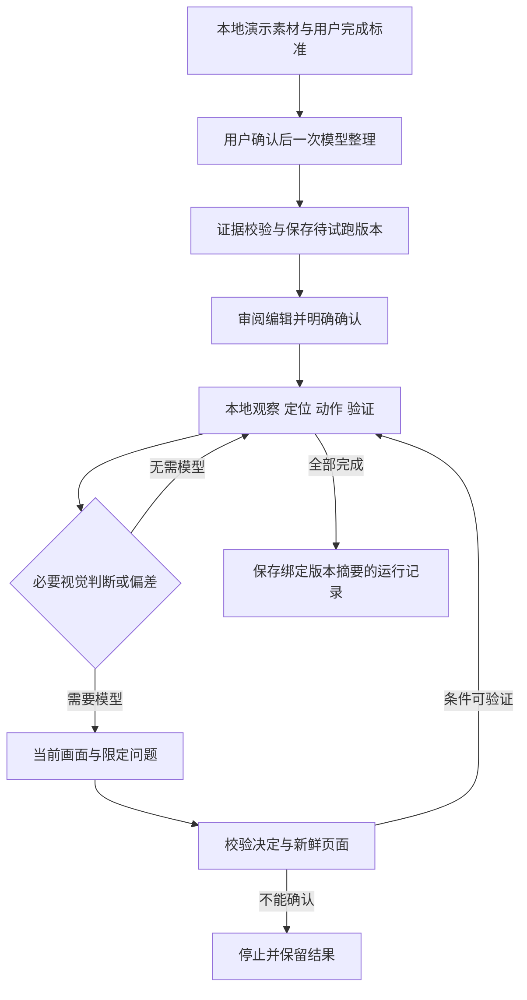

# 演示学习与操作复用：当前实现与后续设计

更新：2026-09-28。当前 Demo 为 **`1.12.0 / 125`**，已实现“本地录制 → 完成标准 → 手动 AI 整理 → 审阅编辑 → 确认试跑 → 再次运行”。Android 15 模拟器上的内置设置流程已用真实 GLM 完成整理、试跑和同版本再次运行；测试统计与产物校验值见[版本台账](demo-app-version-ledger.md)。这不代表用户真机或任意第三方 App 均已验收，尚未发布。

本轮基于 `main@0fa2208` 的既有录制与草稿实现继续开发。早期摸排及 `1.11.0` 起始基线为 `d7a7bad8162e5d29302cdfafe40011498b5c7fee`；下方历史段落保留当时事实。录制素材、整理版本和成功试跑是三种不同状态，不能把事件条数等同于已学步骤，也不能把模型输出等同于执行成功。

当前范围是 App 内手动闭环：已知步骤由本地结构树定位和执行，必要判断或偏差才调用用户当前 API 配置的视觉模型；成功试跑绑定当前版本与内容摘要。没有接入自然语言自动召回、聊天工具、定时运行或周期复用，也没有任意模型坐标执行、输入参数流程或通用业务分支。

历史前置实验在 Android 15 / API 35 模拟器用普通 AccessibilityService 跑通七步设置流程、182px 控件位移、缺失目标停止，以及真实 GLM 判断后返回一次、从原第三步继续。正常混合运行使用一次有效视觉请求。路径提炼当时由 Codex 中的 Astra 完成，当时未验证 Android 内自动提炼。详细材料是[本机实验报告](../.verify-shots/operation-demo-feasibility-20260928-111151/FEASIBILITY-REPORT.md)，未纳入版本库；该实验不替代 `1.12.0` 的 App 内验收。

## 1.11.0 阶段记录：Slice A

本节保留 `1.11.0 / 124` 的实现与验证时点。紧凑浮条获用户“可以测试通过”反馈，详情布局后用户回复“OK”并要求版本保存；认可范围为这两项 UI 调整，设备未注明。当前整理/执行和因果素材约束见后续章节，不从下列历史测试数推导新闭环已通过。

入口为主聊天附件菜单“添加与工具 → 教我操作”。[原生页面](../demo-app/src/main/java/com/ugk/pi/android/testapp/DemoOperationLearningActivity.kt) 提供开始便签、实际准备检查、草稿列表、事件时间线、按需展开的关键画面及明确确认后的素材删除。名称为最多 120 字符的单行文字，键盘“完成”只收起键盘；开始需用户点击。缺少模型配置不阻止本地录制。尚无 AI 整理、步骤编辑、试跑、自动执行或定时复用入口。

草稿详情采用暖纸摘要卡承载状态、标题、日期与两列真实统计；空记录展示简洁空状态和“重新录制”，有记录展示分层时间线。重新录制只打开新的开始卡，保留当前草稿。记录说明默认折叠到主体之后，完整说明及关键画面仍按需查看；删除入口在更多菜单内，继续要求确认。浅色正常字号、深色 320dp/1.5 倍字号的两种草稿均经 AVD 检查，见[详情布局验证](../.verify-shots/operation-draft-layout-20260928/REPORT.md)。

[录制器](../demo-app/src/main/java/com/ugk/pi/android/testapp/DemoOperationRecorder.kt) 要求 Android 11 / API 30+、已连接的无障碍服务、悬浮窗权限和解锁状态。开始后进入桌面供用户选择目标 App；宿主、系统解析到的桌面及输入法事件不采集。采集点击、长按、滚动及窗口切换事件，关联有界页面结构与稳定关键帧；无法可靠关联的前后画面保留缺口说明，不把动作发生当成成功验证。图片使用普通 AccessibilityService 截图，没有新增 MediaProjection 或广泛存储权限。

状态为 `IDLE / RECORDING / PAUSED / SAVING`。暂停保持屏幕占用、使在途回调失效，不接收新的事件或画面；显示时长为实际录制累计时长，暂停时冻结。含输入控件、密码或输入法的页面采用保守暂停；继续必须由用户点击。在宿主或桌面点击继续会等待切回目标 App，不采集宿主/桌面；外部输入页面仍不能直接继续。后置帧仅能关联同一连续采集段、同一 App 的待处理事件，暂停或换包后不补到旧事件。取消保留中断草稿；服务断开、锁定或熄屏也停止并保存。保存结束前维持占用，浮条结束后自动打开对应草稿。

控制器由 `DemoProcessScope` 持有，Activity 旋转和切到目标 App 只附着/解绑 UI。人工录制与普通 Agent（包括尚在思考阶段）共用 `DemoCapabilityInterlock` 的 owner；非 Idle 的计时、排队消息、待处理 SDK_EVENT、重要提醒或确认窗口阻止开始录制。录制期间主界面和悬浮发送、会话切换/新建、设置及新的 Agent/SDK_EVENT 运行受到门禁；主会话停止入口可停止并保存录制。既有计时到点仍运行普通 Agent，没有接入录制草稿执行。

[本地存储](../demo-app/src/main/java/com/ugk/pi/android/testapp/DemoOperationDraftStore.kt) 位于 `<filesDir>/operation-learning/<draftId>/`，包括 `draft.json`、活动标记和关键帧文件。开始先持久化初始草稿与活动标记，再接收事件；后续串行原子检查点写入。进程可能没有退出回调，下次读取会扫描可读草稿，把未结束记录标为中断（即使活动标记缺失），清除已结束草稿的陈旧标记，不自动继续录制。损坏记录保留而不覆盖；未恢复或活动草稿不可删除。当前上限为 20 份草稿、单次 500 事件/40 帧/12MB 图片/8MB 结构文件，单次总会话 10 分钟（含暂停）；不自动淘汰旧草稿。记录中包含屏幕上可见文字，输入保护不能视为完整隐私识别，用户应查看素材并按需删除。

暂停/取消前已验证的画面，若文件写入已开始，可能完成在途写入；失效后不会纳入草稿，并删除该次未引用文件。若此时进程死亡，下次恢复仅移除可读、已收束草稿目录中符合采集器 UUID 命名且未被引用的 JPEG/临时图片，保留被引用素材、未知文件和损坏目录。不能将这一机制表述为“暂停后绝无任何磁盘写入”。

已观察到的系统边界：Android Settings 部分子页强制隐藏普通悬浮窗；不绕过系统限制，用户可回桌面或本 App 暂停/结束。录制页及主界面可见时隐藏重复浮条，回桌面恢复显示，已在 AVD 实测。当前录制浮条按用户反馈改为约 208×52dp 单行：呼吸录制点、计时、暂停/继续及结束图标；暂停时指示点静止，时间冻结，两个图标各有 48dp 触控区。浅深色和 1.5 倍字体定向测试及模拟器操作通过，见[紧凑浮条报告](../.verify-shots/operation-recording-compact-20260928/REPORT.md)；下段 280dp 和 250 项 JVM 测试是调整前的 Slice A 阶段证据。

阶段证据见[本机验证报告](../.verify-shots/operation-learning-integration-20260928/REPORT.md)：API 35 AVD 的 `SettingsDemo` 草稿 `3795dc1b-0484-47a1-a7b1-b2c12b875e66` 实录 **7 个事件、3 张关键帧、85 个节点**；暂停后操作 Settings，草稿字节保持不变；结束后打开真实草稿。搜索输入页自动暂停，测试输入没有进入草稿；进程强制结束后保留 3 事件/1 帧并标为中断；服务关闭与熄屏均停止录制。原生控件浅色/深色、280dp 与 1.5 倍字体检查通过，1080×1600 短屏下暂停/结束保持可达。最终构建及 Demo 206 + System skill 44 = **250 项 JVM 测试**通过，另有录制控件仪器测试 1 项通过。该结果不是“七个已学习步骤”，不证明自动整理/执行已完成。录制中使用 UIAutomator dump 会干扰该 AVD 的无障碍服务，采集中使用 screencap 和自有草稿数据观察。本轮 Slice A 未调用外部模型 API。

## 1. 当前组成与职责

实现位于 `demo-app`，未新增 SDK 模块；Core 与 `pi-system` 公共接口保持原有职责。`SKILL.md` 仍是模型上下文，不承担路径或素材执行。

| 组件 | 当前职责 |
|---|---|
| [DemoOperationRecorder](../demo-app/src/main/java/com/ugk/pi/android/testapp/DemoOperationRecorder.kt)、`DemoOperationCapture`、`DemoOperationDraftStore` | 本地事件、结构与关键帧采集，暂停/退出、因果关联、草稿持久化 |
| [DemoWorkflowCompiler](../demo-app/src/main/java/com/ugk/pi/android/testapp/DemoWorkflowCompiler.kt) | 一次有界模型请求，将用户目标、完成标准与演示素材整理为路径；本地检查 schema、动作目标及前后证据 |
| [DemoWorkflowRepository](../demo-app/src/main/java/com/ugk/pi/android/testapp/DemoWorkflowRepository.kt)、`DemoWorkflowModels` | 独立保存本地意图说明、不可变路径版本、摘要和运行记录；恢复未结束记录为中断 |
| [DemoWorkflowRunner](../demo-app/src/main/java/com/ugk/pi/android/testapp/DemoWorkflowRunner.kt) | 本地步骤循环、有限等待、语义后置条件、必要视觉检查与受限恢复 |
| [DemoWorkflowActionGateway](../demo-app/src/main/java/com/ugk/pi/android/testapp/DemoWorkflowActionGateway.kt) | 本轮用户授权、固定版本/步骤/应用校验、唯一目标、取消及动作不重放 |
| [DemoWorkflowController](../demo-app/src/main/java/com/ugk/pi/android/testapp/DemoWorkflowController.kt)、`DemoProcessScope` | 进程持有工作、忙闲与停止、固定本轮 API 配置、先保存运行结果再通知 UI |
| [DemoOperationLearningActivity](../demo-app/src/main/java/com/ugk/pi/android/testapp/DemoOperationLearningActivity.kt)、`DemoWorkflowUi`、`DemoWorkflowOverlay` | 录后完成标准、本地保存、整理确认、步骤审阅/编辑、试跑确认、再次运行及紧凑停止入口 |

执行复用 [ScreenAutomationBackend](../pi-system-skill-android/src/main/java/com/ugk/pi/android/ScreenAutomationBackend.kt) 与默认无障碍后端；保留最新 snapshot、目标与 bounds 校验。模型复用 `ProviderProfile.createRuntimeProvider` 和 Core 图片消息，不进入完整 `AgentRuntime` 逐轮工具循环，也不经过计时意图路由。

## 2. 当前用户闭环

入口保持“添加与工具 → 教我操作”。完整录制/视觉闭环要求 API 30+、已连接的无障碍服务、悬浮窗权限、解锁且屏幕可交互；App 原有 minSdk 24 不代表低版本支持此能力。录制不需要模型配置，整理与必要 AI 判断才使用用户当前主 API 配置。

1. **录制与说明**：本机保留原始事件、页面结构与关键帧；事件条数不等于步骤数。结束后自动询问一次“怎样算完成”，目标默认录制名称，独立完成标准最多 1000 字，例如“出现今日已签到”。用户可仅“保存说明”或“稍后填写”，均不调用模型。草稿保留补充入口；无事件时提示重新录制并保留原素材。
2. **手动整理**：用户点击“整理成操作”，分别核对目标与完成标准，明确确认两项说明和素材将发送至当前 API。编译为一次请求，最多发送六张代表关键帧；失败或取消保留草稿，不自动再付费重试。
3. **审阅与修改**：查看整项完成标准、步骤、目标 App、逐步完成条件、必要 AI 判断及不确定项；原始记录默认折叠。可以编辑名称、目标、步骤标题和逐步完成判据，删除多余步骤。动作类型、目标 App 和动作 selector 不开放任意编辑；改已有完成文字保留原控件及选中状态要求，无文字的检查继续保留。
4. **更新版本或标准**：一般编辑保存为新的不可变版本，历史记录保留。整项完成标准不可只改字段沿用旧判据；“修改标准并重新整理”先保存本地说明，再弹出明确的 API 整理确认。若取消确认，保留新标准并显示“待重新整理”；最新说明与计划标准不一致时禁止试跑/再次运行。重新整理生成新版本后须重新试跑。
5. **确认试跑**：确认卡展示整项完成标准、具体目标 App、步骤数、动作范围、画面分析、最多一次返回恢复及五分钟上限。只有“开始试跑”正向按钮启动；授权不来自编译结果或模型回答。
6. **再次运行**：最新本地标准与计划一致，且当前 `draftId + version + digest` 存在 `isTrial=true`、`status=succeeded` 的持久记录，才显示“可运行”和“再次运行”。再次执行仍需本次确认；结束后打开对应操作与真实运行记录，不向原聊天自动追加摘要。

停止录制只是素材终点，最后一张截图不自动成为成功画面。完成标准表达用户期望看到的可观察结果，编译根据标准与证据形成可检查的完成条件；素材不足以支撑该结果时应补录，不能因录到了某个页面就推定任务已完成。缺少标准的旧计划仍可查看，需要补充标准并重新整理。

当前动作范围是 `launch / click / long_click / scroll_forward / scroll_backward / back / check`。路径首步必须是有记录依据的目标 App 启动准备，后续不得再插入任意启动；最多四十步，每步必须有语义完成条件或明确视觉问题，单凭包名不能宣告成功。执行范围是已登录、解锁、可观察的固定流程。输入页面、复杂手势、缺失控件、重复匹配或不完整结构不会猜测通过。

“今日已完成则跳过、否则进入另一段”这类通用业务分支尚未接入；当前视觉检查验证当前步骤或停止，不让模型改步骤序号、跳过尚未派发的动作。第三方 App 打卡与长期稳定成功率仍须目标 App 实测。

## 3. 素材因果关系与旧草稿

动作目标必须来自对应事件本身；允许映射到其唯一可点击祖先的语义子项，不借同一画面中的邻居控件代替目标。点击/长按必须有该动作自己的后置关联，后续窗口或滚动事件不能替它证明结果。返回和滚动方向需要对应的、实际发送给模型的不同前后关键帧，并保留审阅提示；零位移的布局通知不能自动变为滚动步骤。语义完成条件来自同一关联后置帧，视觉问题必须有本次实际发送的对应画面。

采集不会把动作发生后的截图标为动作之前的证据。暂停、换 App、连续动作或采集时序无法建立可靠关系时，记录缺口；整理不能把这些缺口补成确定路径。`1.11.0` 的旧草稿仍可查看，但缺少因果前后素材时会拒绝整理并要求补录，不能迁移为伪造的成功步骤。已有事件或模型“看起来理解了”都不能替代本地证据校验。

录制继续在本机进行；原始素材只在用户确认整理时发送。记录仍可能含页面可见文字，输入保护不等于完整隐私识别。API 凭据不作为路径字段、运行日志或模型素材写入。

## 4. 本地执行与必要模型判断

每步检查取消与授权，读取新鲜 UI 树，唯一定位语义目标，派发声明动作，再有限等待并验证结果。保存的是文字、描述、资源 ID、类型及必要选中状态，重跑时重新解析节点；历史 `nodeId`、`snapshotId`、绝对坐标不能直接重放。结构树被截断、目标不唯一或输入页面会停止。Android 接受动作不等于步骤完成；动作已派发但结果不明时可以继续观察，不再次点击或提交。

视觉请求只带本次目标、用户完成标准、当前步骤、当前画面和限定判据，不携带全部演示或聊天历史。模型只可返回受限 `pass / observe / back / stop`：动作前不允许 `pass` 跳步；`back` 仅可在尚未派发当前动作时恢复，整轮最多一次；动作之后不能用返回恢复来重放。模型不能生成坐标点击、脚本、工具调用、任意新增步骤或自行宣告整项任务完成。返回后重新读取页面并检查图片时效，旧画面不能直接授权下一步。

当前运行上限五分钟、总模型请求最多十次、偏差判断最多三次；声明的视觉检查点共享“检查点数量 × 2”的请求预算，仍受整轮十次上限约束；这不是每个节点的独立两次硬上限。非法输出、模型/网络失败和无法确认的页面停止并交还用户，不做隐藏重试或静默切换模型。普通 Agent 继续使用其原有逐轮模型循环与确认机制，本地路径执行不会改变该契约。

## 5. 授权、互斥与退出

[动作网关](../demo-app/src/main/java/com/ugk/pi/android/testapp/DemoWorkflowActionGateway.kt) 是 Demo 新增的流程级授权边界，绑定本轮已审阅版本摘要、固定步骤顺序、目标应用、动作范围、恢复次数和有效期。授权来源是原生 UI 的本次正向确认，不是复用单动作票据、伪造 ToolResult 或开启全授权。普通 Agent 的[单动作确认契约](sdk-confirmation-ticket-contract.md)保持原样。

控制器由 `DemoProcessScope` 持有，Activity 附着/解绑只更新视图；跨 App 或页面重建不取消正在进行的整理/运行。整理不取得屏幕 owner。录制、试跑、运行和必要视觉判断取得共享屏幕占用；普通 Agent 正在运行（包括思考阶段）、非 Idle 计时、排队消息、待处理 SDK_EVENT 或交互提醒会阻止开始，不自动取消另一方。运行期间相关主界面/悬浮发送、会话、设置与新派发入口保持门禁。

用户停止立即撤销网关授权，取消后续模型、等待和动作派发；服务断开、锁定或熄屏同样停止。已交给 Android 的动作不能承诺撤回，因此结果不明也不会自动重放。控制器保留占用直到收尾与最终记录持久化，再发布空闲状态。进程退出后，把未结束运行标为中断，不自动继续或补跑；没有长期后台常驻、锁屏自动打卡或重启后续跑承诺。

## 6. 存储与成本

| 对象 | 当前目录与内容 |
|---|---|
| 原始演示 | `<filesDir>/operation-learning/<draftId>/`：草稿、事件、结构、关键帧和采集缺口 |
| 本地说明 | `<filesDir>/operation-workflows/<draftId>/intent.json`：用户目标、完成标准与保存时间；保存本身不发模型请求 |
| 整理版本 | `<filesDir>/operation-workflows/<draftId>/vN.json`：不可变版本、目标、整项完成标准、步骤、判据、来源事件和整理调用数 |
| 运行记录 | 同一工作流目录的 `runs/<runId>.json`：版本、摘要、试跑标记、状态、已验证步数、时间、模型请求/图片数和简短结果 |

仓库最多二十份操作、每份五十个版本和二百条运行记录，单份 JSON 限 256KB；达到上限时拒绝新增，不自动淘汰。旧版本不可原地覆盖，结束记录不被新运行覆盖，原子写入失败保留旧文件。删除由用户明确确认，协调删除整理版本、运行记录和原始素材；忙态禁止删除，未知/损坏文件或未结束记录拒绝清理。不依赖聊天日志或诊断 trace 保存路径，未提供按保留期自动淘汰。

整理与执行沿用用户当前选择的主 API 配置，并在每轮开始时固定配置。支持的协议仍经 `ProviderProfile` 适配，没有第二套视觉 API 设置；GLM 可作为用户配置的服务，但没有硬编码专用 GLM 模型或凭据。需要 AI 的路径在执行前检查所需配置，具体模型的图片能力仍须真实请求验证。

整理版本保存**实际模型请求数、发送图片数及创建时间**；每次运行独立保存请求/图片数、起止时间并展示耗时。整理耗时仅见本机验收探针，不是产品持久统计字段。此链路不走普通 Agent 自动重试，Provider 的隐式 HTTP 重试也禁用；失败请求计入调用数，不额外发起“修正 JSON”请求。Core `ModelResponse` 尚无 token usage，不能显示伪造 tokens、余额差值推算或未测得的费用节省比例。原始网络异常正文不进入用户提示与运行记录。

## 7. UI 与当前验收边界

UI 沿用 `Ui` / `TaskNoteUi`：暖纸摘要与确认卡、森林绿主按钮、琥珀状态标签、中性步骤列表，原始素材默认折叠。录后说明与整理表单分别保留目标和标准，Activity 重建恢复填写内容及已打开表单，单次自动提示状态也保存；保存本地说明与确认模型请求是两个动作。录制浮条仍为约 208×52dp；运行浮条为约 232×52dp，显示状态、真实步数与 48dp 停止入口。宿主页可见时隐藏重复浮条，截图时隐藏并在收尾恢复。系统隐藏 overlay 时通过回到 App 停止，不绕过限制。细节见[UI 基线](demo-app-ui-redesign.md)。

| 范围 | 当前状态 | 验收证据边界 |
|---|---|---|
| Slice A 录制/草稿 | `1.11.0` 已实现且有当时本机定向证据；本轮加强因果关联 | 旧测试与用户认可仅覆盖对应录制/布局阶段 |
| 手动整理/审阅/编辑/试跑 | `1.12.0` 已完成限定本机验收 | 312 项 JVM；真实 GLM 整理与设置流程试跑通过，原生完成标准表单及变更门禁已检查 |
| 同版本再次运行/运行记录 | 成功试跑是运行门槛；同一 v2 再次运行通过 | 最终试跑 8.948 秒、1 次/1 张；再次运行 11.002 秒、2 次/2 张；取消、恢复及不重放边界由定向 JVM 覆盖 |
| 自然语言召回或聊天工具 | 未接入 | 不宣称聊天能自动找到并复用已学操作 |
| 定时或周期复用 | 未接入 | 既有计时仍启动普通 Agent 回合；不变更时间语义或启用旧调度器 |

本轮原生覆盖真实录制到模型整理、固定设置流程试跑与再次运行、完成标准本地保存和变更后取消整理的门禁，以及浅深色、大字号、短屏、键盘与配置变化恢复。版本失效、目标位移/重复匹配/错误包名/过期画面拒绝、必要视觉检查、一次返回恢复、已派发动作不重放、取消、恢复及任务互斥由定向 JVM 测试覆盖；不把这些单元测试写作全部实机故障注入通过。

编译先从真实动作生成经本地验证的有限目标候选，再让模型选择步骤；不让模型凭空拼接按钮身份。页面完成条件使用稳定标识，排除用户未要求的偶然日期、数值等。动作定位仍要求唯一，结果存在性检查允许多个同类控件（例如图表柱子），并在截图前做有界的本地稳定等待。最终设备/配置、成功和失败记录及校验值见[版本台账](demo-app-version-ledger.md)和本机验收报告；旧七步实验及 Slice A 数据不替代本轮结果。未建立同条件重复对照，不宣称成功率、速度或费用节省比例。
