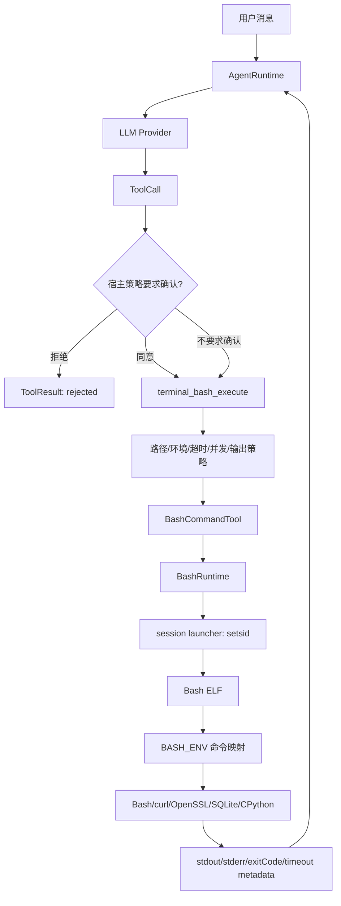

# Terminal Runtime 架构说明

## 1. 运行链路



## 2. 模块依赖

```text
宿主 App
  ├── :ugk-pi-android
  ├── :ugk-terminal-runtime-android
  └── :pi-terminal-skill-android
        └── :ugk-terminal-runtime-android
```

`TerminalAgentPlugin` 是工具和技能的注册入口：

- `tools()` 注册 `terminal_bash_execute`；
- `skills()` 注入使用约束和当前能力；
- `agentInstructions()` 读取打包在 `assets/ugk/AGENTS.md` 的 SDK runtime `AGENTS.md`，并由 `AgentRuntime` 放在每次 `ModelRequest` 的全局 system messages 最前面；
- 默认用 `UserConfirmationRequiredTool` 包装；
- `cancel(callId)`/`cancelAll()` 作用于该 Plugin 持有的同一个 Tool 实例。
- `AgentRuntime.cancelAllPlugins()` 会统一转发已注册 Plugin 的 `cancelAll()`；宿主释放 Runtime
  时先取消工作，再调用 `AgentRuntime.close()`，由 Runtime 幂等地转发 Plugin `close()`。
- `TerminalAgentPlugin` 仍保留 `cancel(callId)` 和 `stopAllLocalHttpServers()` 作为精细控制 API，
  但宿主的通用生命周期不应再按 Terminal 类型做特殊识别。

### 开发规范与运行时规范的边界

仓库根目录 `AGENTS.md` 只约束开发者/Codex 的读写、验证和交付行为，不进入 APK/AAR。SDK runtime
`AGENTS.md` 文件名相同但作用域不同，随 terminal skill 进入宿主 APK，并在 Agent 每次请求时作为全局系统指令注入。
因此模型看到的是面向真实 Android Runtime 的命令能力和替换规则，而不是仓库开发流程。两份文件都必须保留，不能合并或互相复制。

### Android 原生 Intent 与跨 App 自动化链路

Android App-facing actions 不应绕道终端执行。`pi-system-skill-android` 提供白名单
`AndroidAppIntentTool`（Tool 名：`launch_android_app_intent`）和两种宿主接入入口：

- `AndroidIntentAgentPlugin`：只提供确认和 App-facing Intent；
- `AndroidAutomationAgentPlugin`：额外提供 App 查询、包名启动、无障碍状态，以及可选的 Accessibility screen automation。

`AndroidAutomationAgentPlugin` 的 `screenAutomationBackend` 默认为空。轻量宿主不会因此获得屏幕工具；提供
`ScreenAutomationBackend` 后，SDK 才注册统一的 `screen_read_ui_tree`、
`screen_find_ui_element`、`screen_perform_action`、`screen_gesture`、
`screen_press_key` 和 `screen_global_action`。宿主通常使用
`AccessibilityScreenAutomationBackend`，只注入当前 `AccessibilityService` 提供器和宿主包名。

屏幕工具的边界如下：

- `screen_read_ui_tree` 和 `screen_find_ui_element` 只返回有界、值类型的 snapshot，不跨 Tool 调用持有
  `AccessibilityNodeInfo`；
- 每个 snapshot 带 `snapshotId`，节点带窗口/子节点路径形式的 `nodeId`；新的 read/find 会替换当前
  session 的 snapshot，动作必须同时提交最新的 `snapshotId` 和原样 `nodeId`；
- 动作执行前重新解析节点，并比对 package、type、viewId、bounds、text 和 content description；目标变化、节点
  缺失、动作不支持或目标不可交互时 fail-closed；
- 读屏结果、匹配结果为只读 Tool；节点动作、坐标手势、IME action 和全局动作由
  `UserConfirmationRequiredTool` 包装；
- 宿主显式开启 full authorization 时不向模型注册 `show_user_confirmation_dialog`，并同步切换
  Tool description、Skill methods 与 Runtime instructions；该模式只跳过确认，不跳过屏幕目标和结果校验；
- 坐标手势只能使用当前屏幕尺寸，不能假设固定分辨率；服务权限仍必须由用户在系统设置中手动开启。

跨 App 操作的决策规则是：

`find_android_app` → 用户确认 → `launch_android_app` → `get_android_accessibility_status`
→ 用户启用服务 → `screen_read_ui_tree` 或 `screen_find_ui_element`
→ 选择唯一 snapshot target → 用户确认 → 节点动作/手势/全局动作
→ read/find 再验证结果。

`open_url` 只接受带 host 的 `http`/`https` URL，拒绝 `file`、`javascript`、带 user-info 的 URL；
Intent Tool 直接尝试 `Context.startActivity()`，`ActivityNotFoundException` 映射为结构化 `no_handler`，其他
启动异常映射为 `launch_failed`。这些 App-facing 外部动作默认由 `UserConfirmationRequiredTool` 包装。
`AndroidSystemAgentPlugin`、`AndroidIntentAgentPlugin` 和 `AndroidAutomationAgentPlugin` 仍应按宿主需要选择，
不要同时注册提供同名确认 Tool 的多个入口。
### Runtime 管理的本地 HTTP 服务链路

一次性 Bash 调用和需要跨调用持续存在的服务不是同一种生命周期：

```text
Agent 创建网站文件
  → local_http_server_start（一次用户确认）
  → SDK 直接启动 nativeLibraryDir 中的 CPython launcher
  → libugk_session_launcher.so / setsid 建立独立 process group
  → python -m http.server --bind 127.0.0.1
  → local_http_server_status（只读，无确认）
  → launch_android_app_intent(open_url, 返回的 loopback URL)
  → local_http_server_stop（一次用户确认）
```

`local_http_server_start/status/stop` 由 `TerminalAgentPlugin` 注册。服务目录只能是
terminal workspace 下的相对目录，绑定地址固定为 `127.0.0.1`，状态和 process group id
保存在宿主 app-private data；启动和停止使用现有 Runtime 的 session/process-group 管理，
不让 Agent 拼接 `nohup`、`disown` 或 Bash 后台 daemon。`python`/`python3` 在交互脚本中仍是
`BASH_ENV` 注入的 Bash 函数，只有直接调用有效；专用服务 Tool 直接使用真实的已验证 launcher。

该服务仍与宿主共享 Android UID，不是 Android Service、网络隔离沙箱或 App 被杀后的恢复保证。
`127.0.0.1` 只表示同一设备上的浏览器等 App 可访问，不表示局域网或公网可访问。

## 3. 原生载荷和重定位

1. ELF 以 `libugk_*.so` 名称放在 APK `jniLibs` 中。
2. 宿主使用 `jniLibs.useLegacyPackaging = true`，安装后由 Android 提取到该宿主的 `nativeLibraryDir`。
3. Runtime 直接从 `nativeLibraryDir` 启动 ELF，不把可执行代码复制到 app-writable 目录。
4. `libugk_session_launcher.so` 先 `setsid()`，再 `execv()` Bash，使普通 descendant 属于独立 POSIX session/process group。
5. 两个不同 `applicationId` 的 Probe App 必须使用同一 Runtime artifact，验证 nativeLibraryDir、Python prefix、CA 和工作区没有固定包名路径。

未压缩原生库可以被系统映射/加载，但不保证 `nativeLibraryDir` 提供可供 `execve()` 的真实文件；因此当前交付方式保留安装时提取模式。

## 4. 环境模型

`NativeExecutableProcess` 清空 `ProcessBuilder` 初始环境，再由 `BashRuntime` 注入托管变量：

- 路径：`HOME`、`PWD`、`TMPDIR`、`PATH`、`LD_LIBRARY_PATH`；
- Android 根：`ANDROID_DATA=/data`、`ANDROID_ROOT=/system`；
- Runtime：`UGK_NATIVE_LIBRARY_DIR`、session report；
- Bash/网络：`BASH_ENV`、`CURL_CA_BUNDLE`、`SSL_CERT_FILE`；
- Python：`PYTHONHOME`、`PYTHONPATH`、`UGK_PYTHON_LIBRARY`、`UGK_PYTHON_EXTENSION_DIRECTORY` 及无用户 site/bytecode 配置。

Tool 只能增加有限数量、有限长度且不覆盖托管变量的字符串环境项。

## 5. Python、CA 和私有数据

- CPython launcher、`libpython3.14.so` 和 54 个生产扩展留在 `nativeLibraryDir`。
- 纯标准库作为锁定 asset/archive 复制到 app-private data，逐文件校验；损坏时下次调用自修复。
- CA bundle 作为非可执行 APK asset，校验后复制到 app-private data；curl/Python TLS 使用托管路径。
- 不提供 `pip`/`ensurepip`，不支持从网络或可写目录下载/加载任意原生扩展。

## 6. Tool 控制模型

- 每个 `call.id` 只允许一个运行中或排队中的调用；重复 id 返回 `DUPLICATE_CALL_ID`。
- 默认最多并发 2 个，策略上限 4 个；排队项也可以取消。
- 默认超时 15 秒，Tool 策略最大 60 秒，Runtime 硬上限 120 秒。
- stdout/stderr 分别限流，结果带 `outputTruncated`、`stdoutTruncated`、`stderrTruncated`。
- 取消或超时先对 process group 发送 SIGTERM，等待 500ms，必要时 SIGKILL。

这解决的是受控 Runtime 中普通子进程树的生命周期问题，不是跨 UID 安全隔离。主动 `setsid`、独立 Android Service、跨进程逃逸和宿主进程被杀后的恢复不在当前保证范围内。
